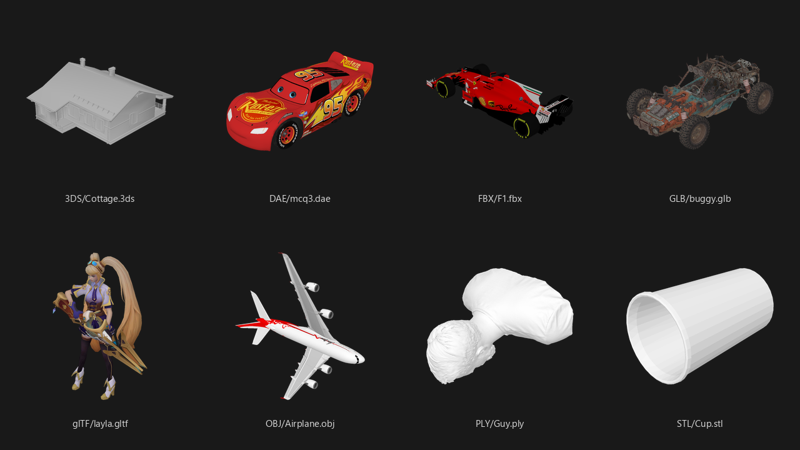

# MeshThumbs

3D model thumbnails for Windows Explorer, with textures, vertex colors, and automatic framing.

**Supported formats**

`OBJ` · `FBX` · `GLB` · `glTF` · `STL` · `DAE` · `PLY` · `3DS`



## Install

Run `MeshThumbs-1.0.1-x64.msi` to install or upgrade, then refresh the model folder.
Uninstall through **Windows Settings → Apps → Installed apps**.

## Build

Requires Windows x64, Rust, a C++ compiler, CMake, and WiX 3.14.

```powershell
.\scripts\build-msi.ps1
```

Keep `thumbnail_provider.dll` and `thumbgen.exe` together for manual registration.

## CLI

```powershell
cargo run -p thumbgen -- model.glb preview.png 256
```

<details>
<summary>Rendering details & troubleshooting</summary>

CPU rendering runs in a separate worker, with a **5-second timeout**, a
**300 MiB file limit**, and a **5-million-triangle limit**. Unsupported, corrupt,
or oversized models may not produce a thumbnail.

Version 1.0.1 fixes dotted PLY previews by rendering mesh surfaces in full.

Logs: `C:\ProgramData\MeshThumbs\meshthumbs.log`.

</details>

## License

MIT · Fork of [3DThumbnails](https://github.com/While402/3DThumbnails) · [Third-party notices](THIRD-PARTY-NOTICES.txt)
